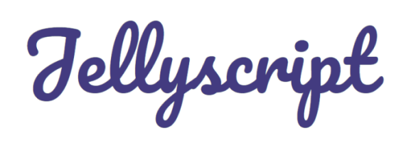

  
   
  <b>A scripting language that f*cks with you</b>
   
   
  

## What is Jellyscript ?
Jellyscript is an esoteric programming language that will screw with your life since it only has 10 commands and can barely even do anything. Jellyscript runs on your browser using HTML and the embeddable Jellyscript's interpreter written in Javascript.

## Usage

### Install
You can install Jellyscript with:

Github:

    git clone https://github.com/nguyenphuminh/Jellyscript.git

NPM:

    npm install --save-dev jelscript

### Setup
Add this to your .html file:
	
    
    

Or:

    
    

## Syntax
Jellyscript use an array with 100000 cells, every cells starts with the value of 0. Your codes will interact with each cells to work.

### Commands
<li>J <b>-></b> move to the next cell.</li>
<li>E <b>-></b> move to the previous cell.</li>
<li>l <b>-></b> increment the value of the cell by 1.</li>
<li>L <b>-></b> increment the value of the cell by -1.</li>
<li>Y <b>-></b> outputs the ASCII value of the current cell.</li>
<li>j <b>-></b> inputs the value of the current cell.</li>
<li>e <b>-></b> outputs "Hello, World!".</li>
<li>y <b>-></b> outputs "I love Jelly!".</li>
<li>_ <b>-></b> space.</li>
<li>- <b>-></b> new line.</li>
<li>S <b>-></b> outputs <i>Java</i>.</li>

### Notes 
Any other characters are referred as comments, which will be ignored.

## Example
Hello World:

    llllllllllllllllllllllllllllllllllllllllllllllllllllllllllllllllllllllllY
    JlllllllllllllllllllllllllllllllllllllllllllllllllllllllllllllllllllllllllllllllllllllllllllllllllllllY
    JllllllllllllllllllllllllllllllllllllllllllllllllllllllllllllllllllllllllllllllllllllllllllllllllllllllllllllY
    JllllllllllllllllllllllllllllllllllllllllllllllllllllllllllllllllllllllllllllllllllllllllllllllllllllllllllllY
    JlllllllllllllllllllllllllllllllllllllllllllllllllllllllllllllllllllllllllllllllllllllllllllllllllllllllllllllllY
    _JlllllllllllllllllllllllllllllllllllllllllllllllllllllllllllllllllllllllllllllllllllllllY
    JlllllllllllllllllllllllllllllllllllllllllllllllllllllllllllllllllllllllllllllllllllllllllllllllllllllllllllllllY
    JllllllllllllllllllllllllllllllllllllllllllllllllllllllllllllllllllllllllllllllllllllllllllllllllllllllllllllllllllY
    JllllllllllllllllllllllllllllllllllllllllllllllllllllllllllllllllllllllllllllllllllllllllllllllllllllllllllllY
    JllllllllllllllllllllllllllllllllllllllllllllllllllllllllllllllllllllllllllllllllllllllllllllllllllllY

## Command line interface
Shows current version:

    fls --version

## Copyrights and Licenses
This language is licensed under the MIT License 

Copyrights © 2020 Nguyen Phu Minh